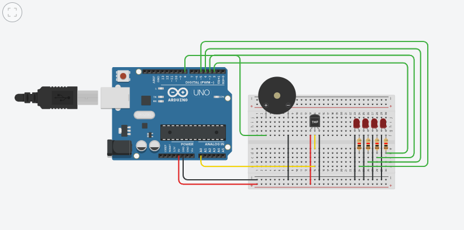
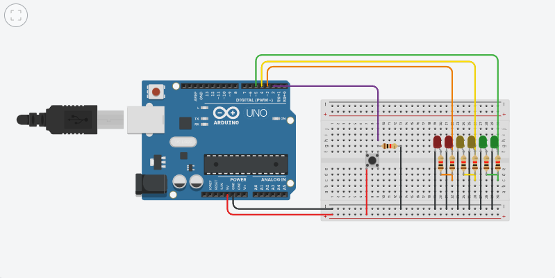
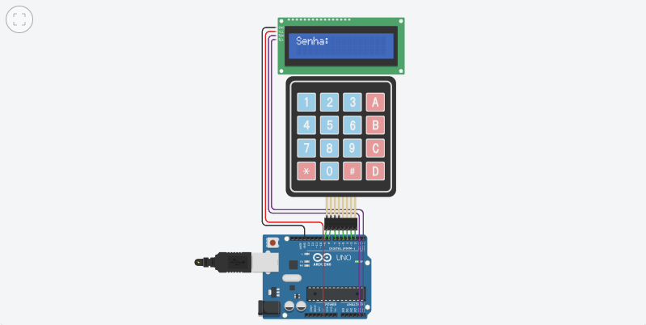
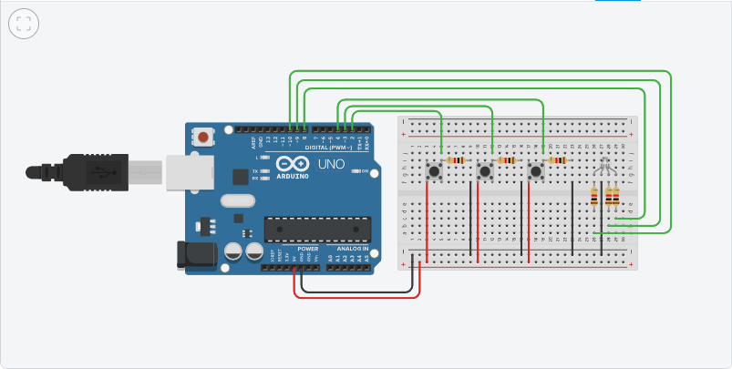

# Projetos Arduino - Mecatrônica

Projetos desenvolvidos durante o curso de Mecatrônica, focando em automação e controle de sistemas.

## Projetos

### 1. Sistema de Alerta de Incêndio
- Função: Detecta temperatura e aciona alarme.
- Link Tinkercad: [Clique aqui](https://www.tinkercad.com/things/amtbgMKbttK-sistema-de-alerta-de-incendio)
- Imagem: 

### 2. Semáforo Inteligente
- Função: Controle de semáforo com botão de pedestre.
- Link Tinkercad: [Clique aqui](https://www.tinkercad.com/things/9EgOlpq1hNx-semaforo-inteligente)
- Imagem: 

### 3. Trava Eletrônica com Keypad
- Função: Cofre digital com senha via keypad.
- Link Tinkercad: [Clique aqui](https://www.tinkercad.com/things/2gQzHHvbeGi-senha)
- Imagem: 

### 4. LED RGB
- Função: Controle de cores via Arduino.
- Link Tinkercad: [Clique aqui](https://www.tinkercad.com/things/9qcUQvGMaKp-led-rgb)
- Imagem: 
